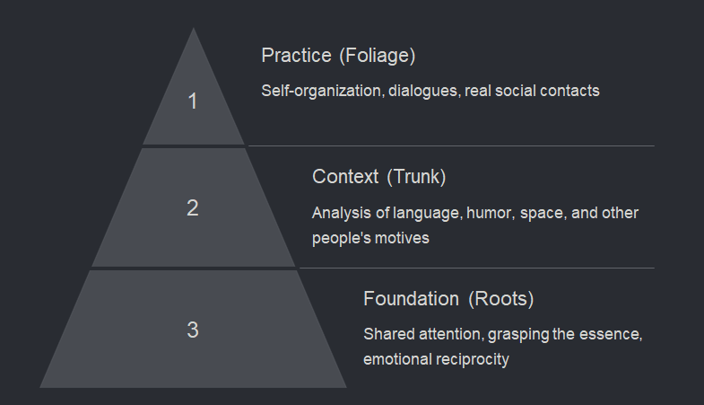
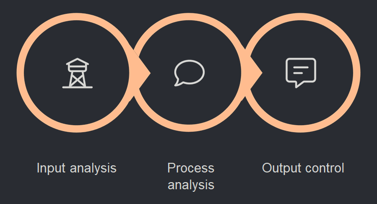

# Communication Code: Developing Adequate Contextual Reaction (ACR) via LLMs

  

[Читать на русском языке](README.ru.md)

Framework that bridges neurobiology and artificial intelligence to help individuals with Autism Spectrum Disorder (ASD) develop social communication skills. By leveraging Large Language Models (LLMs), the project transforms dynamic social contexts into analytical, computational systems using the **Social Thinking** methodology.

## 🧠 The Core Problem
Traditional therapies (ABA, TEACCH, Social Stories) often teach rigid, top-down behavioral patterns. This leads to mechanical responses and a failure to generalize skills when the context shifts. 

"Communication Code" flips the logic using a **Bottom-Up analytical approach**. It compensates for sensory entanglement by treating social situations as structured tasks with clear inputs, processes, and outputs.

## 🚀 Key Framework Features
* **ILAUGH Model Integration:** Translating human intuition into logical, mathematically analyzable blocks.
* **LLM Simulation Environment:** Using AI's high verbal adaptability to avoid rigid script dependencies and prevent "laboratory environment" limitations.
* **Seamless Skill Transfer:** High convergence between AI assistant behaviors and real-world interactions ensures smooth adaptation to everyday life.

  

## 🛠️ Course Structure & Modules
1. **Module 1:** Introduction to AI interlocutor (Anxiety reduction, "Matrix" pattern).
2. **Module 2:** Basic social scripts (Hard algorithms).
3. **Module 3:** Initiative and dialogue (Flexibility development).
4. **Module 4:** Navigating complex situations and handling rejection.
5. **Module 5:** Final Integration & mastering the modeling method.

 

  

## 🔬 Systemic Tools Implemented
* **Prompting & Vectorization:** Input data structuring for LLMs.
* **Component Analysis & Discretization:** Breaking complex situations into elements.
* **Matrix Methods & Euler Diagrams:** Visualizing logical connections.
* **Hidden Markov Models (HMM):** Action sequence forecasting.

---
*Everything has its code... Decode social interaction.*
